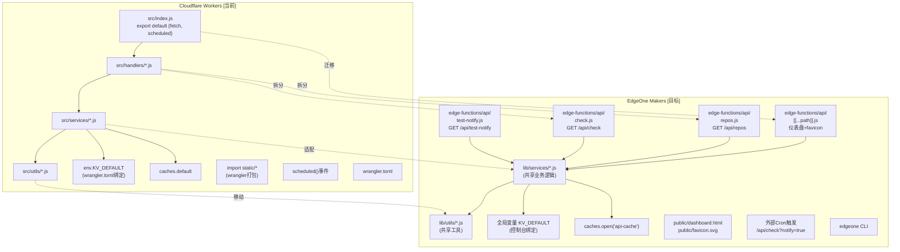

## 产品概述

将 repo-watcher 项目从 Cloudflare Workers 平台迁移至 EdgeOne Makers 边缘函数平台。该项目是一个多平台（GitHub/Gitee/GitLab/CNB）仓库更新监控工具，具备定时检测、缓存优化、KV 持久化、通知推送和可视化仪表盘等功能。

## 核心功能

- **多平台仓库监控**：支持 GitHub、Gitee、GitLab、CNB 四个平台的代码提交检测
- **KV 存储持久化**：使用 KV 存储记录各仓库上次检测的 commit SHA，用于变更比对
- **Cache API 缓存**：缓存外部 API 响应，减少调用频率，避免限流
- **定时/手动触发检测**：支持 Cron 定时任务和 HTTP 手动触发两种模式
- **通知推送**：检测到更新时通过 MagicPush 发送 Markdown 格式通知
- **可视化仪表盘**：内置 Web 仪表盘页面，展示所有监控仓库的实时状态
- **公开 API**：提供 `/api/repos` 跨域接口供第三方集成

## 迁移范围

将以下 Cloudflare 特有能力替换为 EdgeOne Makers 等价实现：

1. Worker 导出格式 (`export default { fetch, scheduled }`) → EdgeOne 边缘函数导出 (`onRequest(context)`)
2. KV 绑定方式 (`env.KV_DEFAULT`) → EdgeOne 全局变量 KV 访问
3. Cache API (`caches.default`) → EdgeOne 标准 Cache API (`caches.open()`)
4. 静态资源导入 (wrangler bundler import) → `public/` 静态文件目录
5. Cron Triggers (`scheduled()` handler) → 外部定时器触发 HTTP 接口
6. 项目配置 (wrangler.toml) → 移除，改用 EdgeOne 控制台 + CLI

## 技术栈

- **目标运行时**：EdgeOne Makers Edge Functions (V8 runtime, ES2023+)
- **开发语言**：JavaScript (ES Modules)，保持与原项目一致
- **部署工具**：EdgeOne Makers CLI (`edgeone makers dev/deploy`)
- **存储服务**：EdgeOne KV Storage（替代 Cloudflare KV）
- **缓存服务**：标准 Cache API（`caches.open()`）
- **静态文件**：EdgeOne `public/` 目录自动托管

## 技术架构

### 架构策略：路由拆分 + 共享库

采用 EdgeOne Makers 的**文件即路由**模式，将原 `src/index.js` 中的集中式路由拆分为独立的边缘函数文件。共享业务逻辑（services/utils）提取到 `lib/` 目录作为公共模块。

### 系统架构对比



### 关键改造点详解

#### 1. 导出格式改造 (核心)

| 项目 | Cloudflare Workers | EdgeOne Makers |
| --- | --- | --- |
| 导出方式 | `export default { fetch, scheduled }` | `export function onRequest(context)` |
| 请求对象 | `fetch(request, env, ctx)` | `onRequest({ request, env, params, waitUntil })` |
| 定时任务 | `async scheduled(event, env, ctx)` | 无原生支持，改用外部 Cron 触发 HTTP |
| 文件路由 | 单入口手动路由 | 文件系统自动映射 URL |


#### 2. KV 存储适配

| 项目 | Cloudflare Workers | EdgeOne Makers |
| --- | --- | --- |
| 访问方式 | `env.KV_DEFAULT` (环境变量绑定) | 全局变量 `KV_DEFAULT` (控制台绑定) |
| 传入方式 | 通过参数传递 `env` | 直接访问全局变量 |
| API 差异 | 完全兼容 | 支持 `get/put/delete/list`, get 支持 `'json'` 类型 |


改造策略：修改 `lib/utils/kv.js`，移除 kv 参数依赖，内部直接访问全局变量 `KV_DEFAULT`；同时修改所有调用方。

#### 3. Cache API 适配

| 项目 | Cloudflare Workers | EdgeOne Makers |
| --- | --- | --- |
| 获取缓存实例 | `caches.default` (预定义默认缓存) | `await caches.open('api-cache')` (需打开命名缓存) |
| 基础 API | `match/put` | `match/put` (兼容) |


改造策略：创建 `lib/utils/cache.js` 封装统一的缓存操作，内部处理 cache open 逻辑。

#### 4. 静态资源处理

| 项目 | Cloudflare Workers | EdgeOne Makers |
| --- | --- | --- |
| HTML/SVG | wrangler 打包为 ES Module import | 放入 `public/` 目录自动托管 |
| 仪表盘 | `import html from '../static/dashboard.html'` | catch-all 路由返回或直接访问 public/ |
| favicon | `import svg from '../static/favicon.svg'` | 同上 |


#### 5. 定时任务替代方案

EdgeOne Edge Functions 不支持 `scheduled()` 事件处理器。替代方案：

- 在 EdgeOne 控制台或使用外部 cron 服务（如 cron-job.org、腾讯云 SCF 定时触发器）
- 定时调用 `GET /api/check?notify=true` 接口实现同等功能
- 该接口已存在，无需额外开发

## 目录结构

```
repo-watcher/
├── edge-functions/
│   └── api/
│       ├── [[...path]].js          # [NEW] Catch-all 路由: 仪表盘页面 + favicon
│       ├── repos.js                # [NEW] GET /api/repos 公开接口
│       ├── check.js                # [NEW] GET /api/check 手动检测接口
│       └── test-notify.js          # [NEW] GET /api/test-notify 通知测试
├── lib/                            # [NEW] 共享库目录 (替代 src/)
│   ├── services/
│   │   ├── index.js                # [MODIFY] 服务导出 (调整导入路径)
│   │   ├── github.js               # [MODIFY] KV→全局变量, Cache→caches.open()
│   │   ├── gitee.js                # [MODIFY] 同上
│   │   ├── gitlab.js               # [MODIFY] 同上
│   │   ├── cnb.js                  # [MODIFY] 同上
│   │   └── notify.js               # [MODIFY] 无 KV/Cache 依赖, 仅路径调整
│   └── utils/
│       ├── index.js                # [MODIFY] 工具导出
│       ├── kv.js                   # [MODIFY] 改为访问全局变量 KV_DEFAULT
│       ├── cache.js                # [NEW] Cache API 封装 (caches.open)
│       ├── parser.js               # [MOVE] 无需改动
│       └── datetime.js             # [MOVE] 无需改动
├── public/                         # [NEW] 静态资源目录 (替代 static/)
│   ├── dashboard.html              # [MOVE] 仪表盘页面
│   └── favicon.svg                 # [MOVE] 网站图标
├── package.json                    # [MODIFY] 移除 wrangler, 更新 scripts
├── README.md                       # [MODIFY] 更新部署文档
├── wrangler.toml                   # [DELETE] 不再需要
└── src/                            # [DELETE] 整个目录迁移后删除
    ├── index.js
    ├── handlers/
    ├── services/
    └── utils/
```

## 实现要点

### KV 操作改造 (lib/utils/kv.js)

```javascript
// 改造前: 参数化 KV 实例
export async function getRepoData(kv, key, platform) { await kv.get(key); }

// 改造后: 直接访问全局变量
// 注意: KV_DEFAULT 是在控制台绑定的全局变量名
export async function getRepoData(key, platform) {
  const data = await KV_DEFAULT.get(key, 'json');
  // ...
}
```

### Cache 操作封装 (lib/utils/cache.js - 新建)

```javascript
let cacheInstance = null;

async function getCache() {
  if (!cacheInstance) {
    cacheInstance = await caches.open('api-cache');
  }
  return cacheInstance;
}

export async function getCached(cacheKey) { /* match */ }
export async function setCached(cacheKey, response) { /* put */ }
```

### 服务层调用改造 (以 github.js 为例)

```javascript
// 改造前:
const previousData = await getRepoData(env.KV_DEFAULT, repoKey, 'github');
const cache = caches.default;

// 改造后:
const previousData = await getRepoData(repoKey, 'github');
const cache = await getCache();
```

### 路由处理器示例 (edge-functions/api/check.js)

```javascript
import { checkRepoUpdate, ... } from '../../lib/services/index.js';

export async function onRequestGet(context) {
  const url = new URL(context.request.url);
  // 复用原有 handleCheck 逻辑, env 来自 context.env
}
```

### Skill 扩展

- **edgeone-makers-edge-functions**
- 用途：提供 EdgeOne 边缘函数的开发规范、导出格式、Context 对象结构、KV 存储用法等权威参考
- 预期成果：确保所有边缘函数代码严格符合 EdgeOne Makers 规范
- **edgeone-makers-storage**
- 用途：提供 EdgeOne KV Storage 的完整 API 参考和使用约束（全局变量方式、get/put/delete/list）
- 预期成果：确保 KV 操作代码正确使用 EdgeOne 的全局变量模式
- **makers-cli**
- 用途：提供 EdgeOne Makers CLI 命令参考，用于项目初始化、开发调试和部署操作
- 预期成果：正确执行 edgeone CLI 命令完成项目构建和部署验证